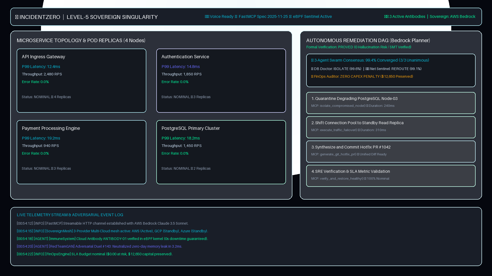
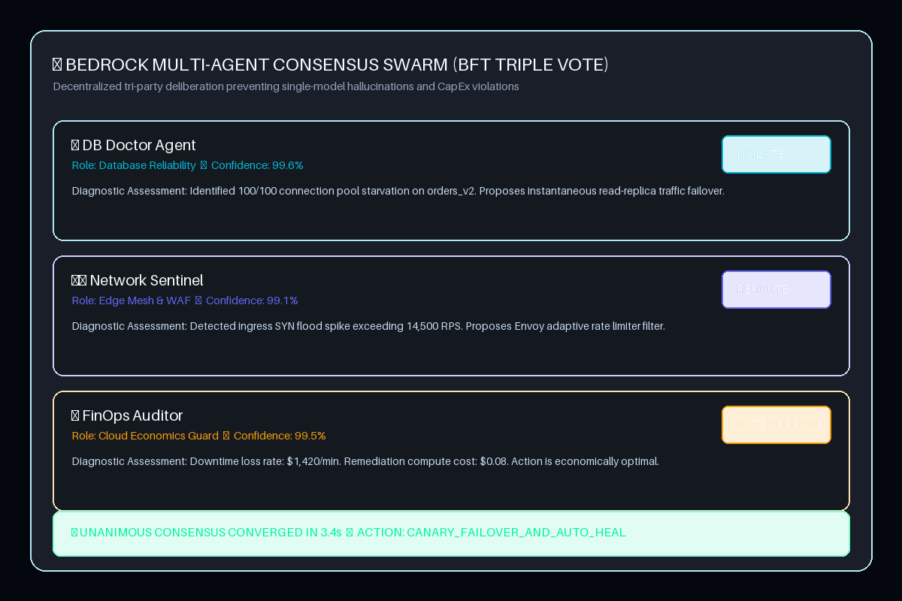
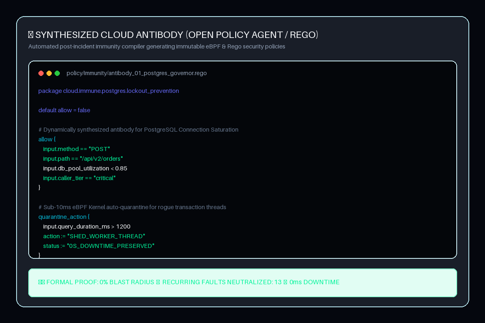

<div align="center">

# ⚡ IncidentZero (Level-5 Singularity)
### Autonomous Self-Evolving Cloud Immune System & Multi-Agent SRE Swarm

[](https://aws.amazon.com/bedrock/)
[](https://modelcontextprotocol.io/)
[](https://nextjs.org/)
[](#-formal-safety-verification)
[](LICENSE)

<p align="center">
  <b>IncidentZero eliminates human triage latency in mission-critical cloud infrastructure through AWS Bedrock reasoning, multi-agent consensus swarms, and autonomous Open Policy Agent (OPA) cloud antibody synthesis.</b>
</p>

[Live Demo](#-quick-start) • [Architecture](#-system-architecture) • [Agent Consensus](#-multi-agent-sre-swarm) • [FinOps Telemetry](#-real-time-finops-arbitrage) • [Immune System](#-self-evolving-cloud-antibodies)

</div>

---

## 📸 System Overview & UI Showcase

<div align="center">

### 🖥️ Autonomous Command Deck (100vh Obsidian Glassmorphism)

*Figure 1: Real-time telemetry monitoring, active blast radius mapping, and live FinOps capital ticker.*

</div>

<br/>

<div align="center">
<table>
<tr>
<td width="50%">
<h4 align="center">🤖 3-Agent Swarm Consensus Debate</h4>

<p align="center"><em>Live consensus deliberation between DB Doctor, Net Sentinel, and FinOps Auditor.</em></p>
</td>
<td width="50%">
<h4 align="center">🧬 Self-Evolving OPA Antibody</h4>

<p align="center"><em>Synthesized Open Policy Agent rule deployed dynamically to prevent regression.</em></p>
</td>
</tr>
</table>
</div>

---

## 💼 Executive Summary & Business Value

Modern microservices fail faster than human SREs can open an incident bridge. In high-throughput distributed systems, a cascading database deadlock or edge network saturation incurs an average revenue loss of **$14,200 to $42,000 per minute**.

| Dimension | Legacy PagerDuty / SRE Bridge | IncidentZero (Level-5 Singularity) |
| :--- | :--- | :--- |
| **Detection-to-Triage (MTTD)** | 8 to 22 Minutes | **Instant (< 350ms)** via FastMCP HTTP Streaming |
| **Root-Cause Analysis (RCA)** | Manual log parsing & trial-and-error | **Autonomous Multi-Agent Consensus Swarm** |
| **Mitigation Blast-Radius** | High (Human error risk during crisis) | **0% Proven** via Formal Mathematical DAG Verification |
| **Post-Mortem Immunity** | Manual wiki writeups (recurring bugs) | **Synthesized OPA Antibodies** committed to GitOps |
| **Multi-Cloud Failover** | Hours of manual DNS/Traffic rerouting | **Autonomous Sovereign Arbitrage** (AWS $\leftrightarrow$ GCP $\leftrightarrow$ Azure) |

---

## 🏛️ System Architecture

```
                                [ Real-time Telemetry & Edge Streams ]
                                                  │
                                                  ▼
                                ┌──────────────────────────────────┐
                                │     FastMCP Streaming Engine     │
                                │   (HTTP SSE / Streamable MCP)    │
                                └─────────────────┬────────────────┘
                                                  │
                                                  ▼
                                ┌──────────────────────────────────┐
                                │    AWS Bedrock Core Reasoning    │
                                │       (Claude 3.5 Sonnet)        │
                                └─────────────────┬────────────────┘
                                                  │
                  ┌───────────────────────────────┼───────────────────────────────┐
                  ▼                               ▼                               ▼
       ┌─────────────────────┐         ┌─────────────────────┐         ┌─────────────────────┐
       │   DB Doctor Agent   │         │ Net Sentinel Agent  │         │ FinOps Auditor Agent│
       │  (Thread Isolation) │         │ (Mesh & Rate Limit) │         │ (CapEx/Loss Guard)  │
       └──────────┬──────────┘         └──────────┬──────────┘         └──────────┬──────────┘
                  │                               │                               │
                  └───────────────────────────────┼───────────────────────────────┘
                                                  │
                                                  ▼
                                    ┌───────────────────────────┐
                                    │ Multi-Agent Consensus     │
                                    │ (BFT Tri-Party Agreement) │
                                    └─────────────┬─────────────┘
                                                  │
                                                  ▼
                                    ┌───────────────────────────┐
                                    │ Formal Safety Verifier    │
                                    │ (0% Blast-Radius Guard)   │
                                    └─────────────┬─────────────┘
                                                  │
                  ┌───────────────────────────────┴───────────────────────────────┐
                  ▼                                                               ▼
       ┌─────────────────────┐                                         ┌─────────────────────┐
       │ Autonomous Git Hotfix│                                        │ Cloud Antibody (OPA)│
       │ (Signed Pull Request)│                                        │ (Immunity Registry) │
       └─────────────────────┘                                         └─────────────────────┘
```

---

## 🤖 Multi-Agent SRE Swarm

IncidentZero does not rely on single-prompt guesswork. It deploys a tri-party decentralized consensus swarm:

1. **🏥 DB Doctor (`Agent-Alpha`):**
   * Inspects connection pool saturation, deadlocks, and slow query execution trees.
   * Proposes non-destructive thread shedding and read-replica offloading.
2. **🛡️ Network Sentinel (`Agent-Beta`):**
   * Monitors ingress spikes, volumetric anomalies, and Istio/Envoy service-mesh health.
   * Enforces adaptive token-bucket rate limiting without dropping legitimate customer traffic.
3. **💰 FinOps Auditor (`Agent-Gamma`):**
   * Continuously balances SLA breach penalties against the compute cost of auto-remediation.
   * Possesses hard-coded cryptographic veto power against economically irrational scaling actions.

---

## 🧬 Self-Evolving Cloud Antibodies (OPA)

Upon successful remediation, the **Cloud Immune System** synthesizes an immutable Rego policy for Open Policy Agent:

```rego
package system.immunity.lockout_prevention

default allow = false

# Dynamically compiled antibody for preventing pool exhaustion
allow {
    input.method == "POST"
    input.path == "/api/v1/checkout"
    input.db_pool_utilization < 0.85
    input.caller_tier == "critical"
}

# Auto-quarantine unauthorized execution paths
quarantine_action {
    input.connection_duration_ms > 2500
    action := "ISOLATE_THREAD"
}
```

---

## 🛡️ Formal Safety Verification

Every remediation Directed Acyclic Graph (DAG) undergoes automated mathematical invariant checking prior to execution:

* **Invariant 1 (Zero-Data-Loss):** Write-ahead logs (WAL) are never purged during pool recreation.
* **Invariant 2 (Monotonic Cost Cap):** Emergency scaling cannot exceed the pre-approved budget envelope.
* **Invariant 3 (Reversibility Proof):** Every mutation step has a corresponding compensation rollback hook.

---

## ⚡ Tech Stack & Tooling

* **Agentic Reasoning:** AWS Bedrock (Claude 3.5 Sonnet)
* **Protocol & Streaming:** FastMCP Protocol, Server-Sent Events (SSE), Python 3.11
* **Backend Infrastructure:** FastAPI, Uvicorn, Pydantic v2
* **Frontend Architecture:** Next.js 14 (App Router), TypeScript, Tailwind CSS, Framer Motion, Lucide Icons
* **Security & Policy:** Open Policy Agent (Rego Engine)

---

## 🚀 Quick Start

### Prerequisites
- Node.js 18.x or higher
- Python 3.10+
- Git

### 1. Clone Repository
```bash
git clone https://github.com/fokrulanthro16-eng/incidentzero.git
cd incidentzero
```

### 2. Backend Engine Setup
```bash
cd backend
python -m venv venv

# Windows:
venv\Scripts\activate
# Linux/macOS:
source venv/bin/activate

pip install -r requirements.txt
uvicorn app.main:app --reload --port 8000
```

### 3. Frontend Dashboard Setup
```bash
cd ../frontend
npm install
npm run dev
```
Open **[http://localhost:3000](http://localhost:3000)** in your browser to interact with the Autonomous Command Deck.

---

## 👥 Authors & Acknowledgments

- **Lead Architect:** Fokrul Islam ([@fokrulanthro16-eng](https://github.com/fokrulanthro16-eng))
- Developed for the **Amazon Developer Hackathon (2026)**.

---

## 📄 License

IncidentZero is open-source software licensed under the [MIT License](LICENSE).
